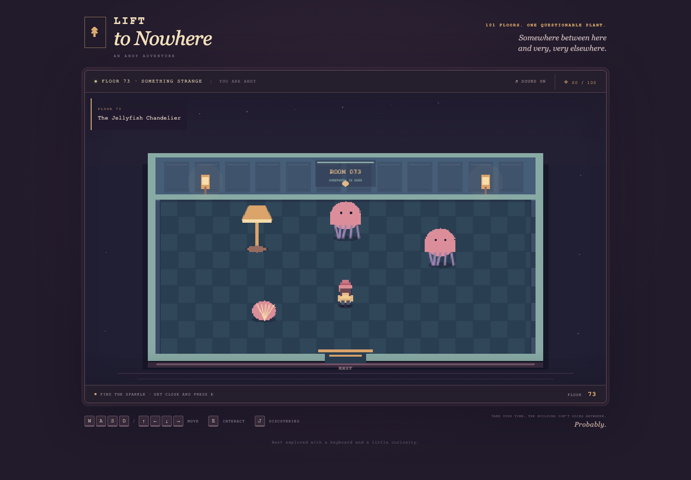

# Elevator to Nowhere

A tiny arcade exploration game starring **Andy**. One elevator, 100 collectible discoveries, and a dangerous bonus floor: **101 — The Last Supper Club**. Get too close to its enormous carnivorous plant and Andy becomes lunch. The game-over screen lets you restart in the lobby with your discoveries intact.

This project was part of [Codex LDN](https://luma.com/codex-ldn-4?tk=etxzmW).

## Play locally

Run `python3 -m http.server 4173 --bind 127.0.0.1` from this folder, then open [the game](http://127.0.0.1:4173). No installation is needed to play.

- **WASD / arrow keys:** walk
- **E:** interact near doors, the elevator panel, and discoveries
- **J:** Andy’s Discoveries
- **M:** mute
- **Escape:** close a panel

Walk into the lift at the back of the lobby. Approach the brass panel on the right, press E, and type a floor from 1 to 101. On arrival, leave through the bottom of the elevator. Open the door at the top of the landing and walk through. Floors 1–100 award stamps; floor 101 has an appetite instead.

Progress and sound preferences are saved in this browser. Saving being unavailable does not prevent play. Desktop keyboard controls; no backend, runtime dependencies, remote fonts, downloaded art, or accounts.

## Development

- `src/game.mjs`: state transitions, movement, interaction, UI and saving
- `src/floors.mjs`: 101 bespoke floor definitions
- `src/render.mjs`: pixel artwork, rooms and visual payoffs
- `src/core.mjs`: validation, collision and persistence logic
- `src/audio.mjs`: synthesized sound

Open [the inspector](http://127.0.0.1:4173/?dev=1) to jump between floors and trigger encounters. Inspector controls are absent in normal play. The inspector uses the same local collection as normal play.

Run `npm test` for catalogue, input, collision, and persistence checks. For browser tests, run `npm install`, `npx playwright install chromium`, then `npm run test:browser`.
